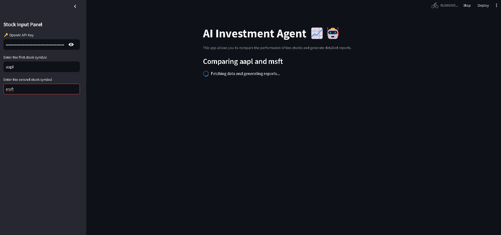

Here’s a clean and well-structured **README.md** for your project:

---

# 📈 AI Investment Agent 🤖  

An AI-powered investment analysis app that allows you to compare the performance of two stocks and generate detailed reports. Built with **Streamlit** for the user interface and powered by **OpenAI GPT-4o** with **YFinance Tools** for stock data.

[Demo](https://bravyn-investorr-app-5aervc.streamlit.app/)
---

## 🚀 Features  

- **User-Friendly UI**: Simple sidebar for entering stock symbols and API keys.  
- **Stock Comparison**: Compare two stocks based on real-time market data.  
- **Insights & Reports**: Fetch stock prices, analyst recommendations, company info, and latest news.  
- **Integration with OpenAI**: Harness the power of GPT-4o to generate actionable insights.

---

## 🛠️ Technologies Used  

- **Python**  
- **Streamlit** - For the web-based user interface  
- **OpenAI GPT-4o** - For AI-driven analysis  
- **YFinance Tools** - For fetching financial data  

---

## 🔧 Installation  

Follow these steps to set up and run the project locally:

1. **Clone the Repository**:
   ```bash
   git clone https://gitlab.com/your-repo-link.git
   cd ai-investment-agent
   ```

2. **Set Up the Environment**:
   Install required libraries using `pip`:
   ```bash
   pip install streamlit openai phi-tools
   ```

3. **Run the App**:
   ```bash
   streamlit run app.py
   ```

4. **Add Your OpenAI API Key**:  
   - You will be prompted to enter your API key in the app sidebar.

---

## 🖥️ Usage  

1. Open the app in your browser.  
2. Enter your **OpenAI API Key** in the sidebar.  
3. Input two stock symbols (e.g., `AAPL`, `MSFT`).  
4. View the AI-generated comparison report on the main page.  

---

## 📷 Screenshots  

### Sidebar for Input:


### 🎥 Demo Video  


---

## 🧩 Dependencies  

- **Streamlit**: For building the UI.  
- **OpenAI API**: To access GPT-4o capabilities.  
- **Phi Tools**: YFinance tools for fetching stock data.  

---

## 💡 Future Improvements  

- Add historical performance graphs for selected stocks.  
- Include additional financial metrics (e.g., P/E ratio, market cap).  
- Enable comparison of multiple stocks simultaneously.  

---

## 🤝 Contribution  

Contributions are welcome! If you have ideas or improvements, please follow these steps:

1. Fork the repository.  
2. Create a new branch: `git checkout -b feature-xyz`.  
3. Commit your changes: `git commit -m "Add feature xyz"`.  
4. Push to the branch: `git push origin feature-xyz`.  
5. Submit a pull request.

---

## 📜 License  

This project is licensed under the MIT License. See the [LICENSE](LICENSE) file for details.

---

## 🔗 Connect  

If you found this project helpful or have any feedback, feel free to connect with me on LinkedIn or GitLab!  

---

Enjoy exploring and building with **AI Investment Agent**! 🚀  

